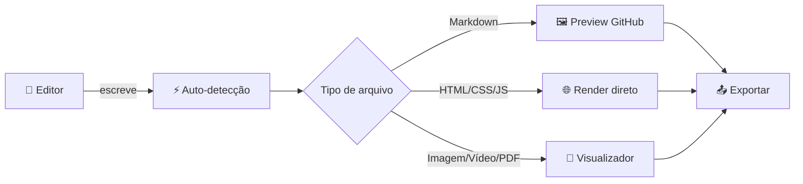
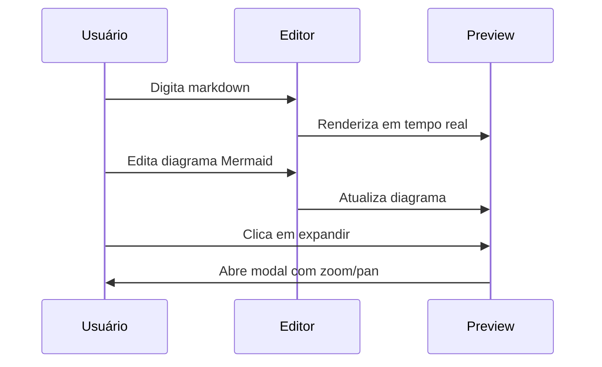

# Bem-vindo ao Notecoder ✦

> **Notecoder** é um editor de código e markdown com pré-visualização ao vivo, suporte a diagramas, fórmulas matemáticas, múltiplos arquivos e temas totalmente personalizáveis.

---

## ✦ Visão Geral



---

## 🗂️ Múltiplos Arquivos & Abas

Gerencie vários arquivos ao mesmo tempo com um sistema completo de abas e painel lateral:

- **Painel lateral** com árvore de diretórios, ícones por tipo e indicador de arquivo ativo
- **Abas** com renomeação por duplo clique — a linguagem é detectada automaticamente ao renomear
- **Criar / Deletar** arquivos diretamente na interface
- **Recolher/expandir** o painel lateral para ganhar espaço na tela

---

## ✍️ Editor Avançado

O editor é construído sobre **CodeMirror** com suporte completo a:

| Linguagem      | Destaque | Auto-detecção |
|----------------|:--------:|:-------------:|
| Markdown        | ✅       | ✅            |
| HTML / SVG      | ✅       | ✅            |
| CSS             | ✅       | ✅            |
| JavaScript      | ✅       | ✅            |
| JSON            | ✅       | ✅            |
| Python          | ✅       | ✅            |
| YAML / XML      | ✅       | ✅            |
| CSV             | ✅       | ✅            |

### Ferramentas do Editor

- 🔍 **Busca e substituição** — <kbd>Ctrl</kbd> + <kbd>F</kbd> — com suporte a regex, maiúsculas/minúsculas e palavra inteira
- 🎨 **Color picker inline** — abre ao clicar em qualquer cor hex, rgb(a) ou hsl(a) no código
- 🔠 **Barra de seleção** — formatar texto selecionado: maiúsculas, minúsculas, lista, etc.
- 🔎 **Zoom** — de 50% a 200%, com reset rápido — aplicado ao editor e ao preview
- 📊 **Contadores** — linhas e caracteres em tempo real na barra de status

---

## 👁️ Modos de Visualização

Alterne entre três layouts com um clique na barra de linguagem:

```
[ Editor ] ←→ [ Split 50/50 ] ←→ [ Preview ]
```

No modo **Split**, a rolagem é sincronizada bidirecionalmente — role o editor e o preview acompanha, e vice-versa.

### Fundo do Preview

Escolha o fundo do painel de preview por arquivo:
- **Tema** — segue as cores do tema ativo
- **Claro** — fundo branco para revisar documentos
- **Escuro** — fundo preto para conteúdo com contraste

---

## 📊 Diagramas Mermaid

Crie visualizações diretamente no Markdown com blocos ```mermaid:



Cada diagrama renderizado inclui uma **barra de ações**:
- 🔍 Expandir em modal com zoom e pan
- 📋 Copiar como imagem PNG
- ⬇️ Baixar como PNG ou SVG

---

## 🧮 Fórmulas Matemáticas (LaTeX)

Escreva equações com sintaxe **KaTeX**:

Inline: $E = mc^2$ ou $\int_0^\infty e^{-x^2} dx = \frac{\sqrt{\pi}}{2}$

Em bloco:

$$\nabla \cdot \mathbf{E} = \frac{\rho}{\varepsilon_0}$$

$$\sum_{n=1}^{\infty} \frac{1}{n^2} = \frac{\pi^2}{6}$$

---

## 💻 Realce de Sintaxe em Blocos de Código

```javascript
// Detecção automática de linguagem por conteúdo
function detectByContent(content) {
  if (content.trimStart().startsWith('{')) return 'json';
  if (/<[a-z][\s\S]*>/i.test(content))    return 'html';
  if (/^def |^import |^class /m.test(content)) return 'python';
  return 'markdown';
}
```

```python
# Python também é suportado
def fibonacci(n: int) -> list[int]:
    a, b = 0, 1
    return [a := a + b for _ in range(n)]
```

```css
/* CSS com color picker inline */
:root {
  --primary: hsl(220 90% 60%);
  --background: hsl(220 15% 10%);
}
```

---

## 📤 Importar & Exportar

### Importar
- 📄 **Arquivo único** — qualquer formato de texto ou binário
- 📁 **Pasta inteira** — mantém estrutura de diretórios
- 🗜️ **ZIP** — descompacta e importa com estrutura preservada
- 🐙 **GitHub** — importe repositórios inteiros ou arquivos selecionados diretamente de uma URL

### Exportar
- Arquivo atual como: **.txt · .md · .html · .css · .json · .js · .svg**
- Todos os arquivos como **.zip** (preserva estrutura de pastas)

---

## 🎨 Temas & Personalização

Três temas inclusos — **Notecoder Night**, **Notecoder Storm** e **Notecoder Light** — totalmente editáveis:

- 🖌️ **28 cores customizáveis** — background, foreground, bordas, syntax, etc.
- 🔤 **Tamanho de fonte** — Pequeno (11px) · Médio (13px) · Grande (15px)
- 🔠 **Família tipográfica** — JetBrains Mono · Sans-serif · Serif
- 📏 **Altura de linha** — Compacta · Normal · Espaçada
- 🔲 **Raio de borda** — Nenhum · Pequeno · Médio · Grande

---

## 📁 Backup Automático em Pasta Local

> Disponível na versão **desktop (Tauri)**

Vincule uma pasta local e o Notecoder:
- Salva todos os arquivos automaticamente ao editar
- Detecta alterações externas e sincroniza em tempo real
- Indica o status na barra inferior: salvando · salvo · erro

---

## 📋 Formatação Markdown Completa

**negrito** · *itálico* · ***negrito itálico*** · ~~tachado~~ · <u>sublinhado</u> · <mark>destacado</mark>

Teclas: <kbd>Ctrl</kbd> + <kbd>S</kbd> · <kbd>Ctrl</kbd> + <kbd>F</kbd>

> [!NOTE]
> O Notecoder suporta alertas estilo GitHub: NOTE, TIP, IMPORTANT, WARNING e CAUTION.

> [!TIP]
> Renomeie um arquivo na aba para mudar sua linguagem automaticamente.

> [!WARNING]
> Fechar a aba não exclui o arquivo — ele permanece no painel lateral.

### Listas de Tarefas
- [x] Editor multi-arquivo com abas
- [x] Preview Markdown estilo GitHub
- [x] Diagramas Mermaid com zoom/export
- [x] Fórmulas LaTeX via KaTeX
- [x] Importação de GitHub, ZIP e pastas
- [x] Temas 100% customizáveis
- [x] Busca e substituição com regex
- [x] Suporte a imagem, vídeo e PDF
- [x] Backup automático em pasta local

---

<div style="text-align:center; opacity: 0.5; font-size: 0.85rem;">

Feito com 90% de IA e 10% de energético. · **Notecoder v1.0**

</div>
